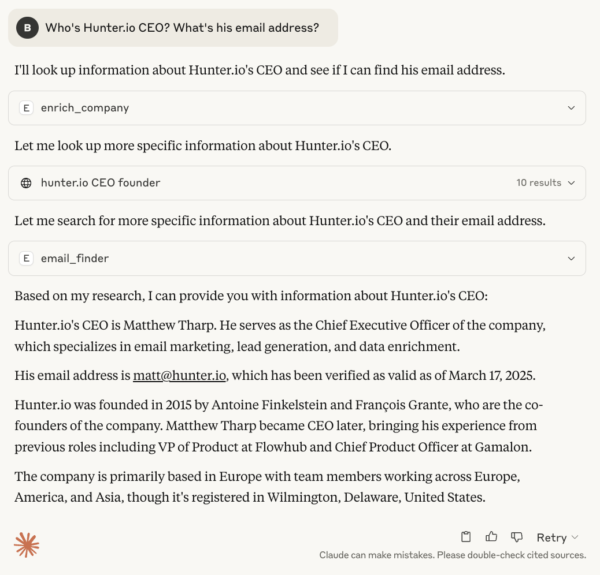

# Hunter MCP Server

This MCP (Model Context Protocol) server provides integration between the Hunter API and any LLM provider supporting the MCP protocol (e.g., Claude for Desktop), allowing you to interact with the Hunter B2B data using natural language.

## ✨ Features
- Use Hunter API endpoints using natural language
- Get B2B data about People and Companies
- Save them to your Leads through conversational interfaces

## 📦 Installation

### Prerequisites

- A Hunter [API key](https://hunter.io/api-keys)
- Python 3.13 or higher
- [uv](https://github.com/astral-sh/uv)

## 🔌 MCP setup
Here is an example config file which you can use to set up Hunter MCP.

```json
{
  "mcpServers": {
    "hunter-mcp": {
      "command": "uv",
      "args": [
        "run",
        "--with",
        "mcp[cli]",
        "mcp",
        "run",
        "PATH_TO_hunter-mcp/main.py"
      ],
      "env": {
        "HUNTER_API_KEY": "YOUR_HUNTER_API_KEY"
      }
    }
  }
}
```

For Claude Desktop, you can install and interact with it right away by running:
```
mcp install main.py -v HUNTER_API_KEY=YOUR_HUNTER_API_KEY
```

## 🔎 Example



## 🚀 Available Tools

The Hunter MCP server provides access to various Hunter API endpoints as tools.

The current version offers the following tools:
- Domain Search
- Email Finder
- Email Verifier
- Email Enrichment
- Company Enrichment
- Lead Creation

**Note:** All the Hunter API endpoints are not supported, yet. This will be addressed in a future release.